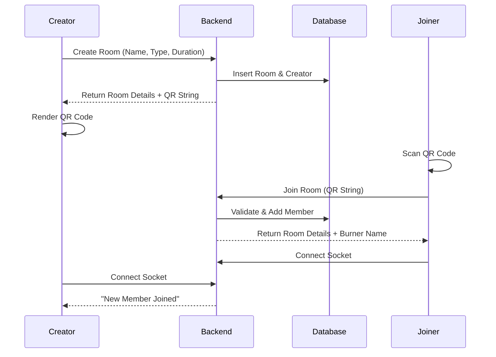

# 🔐 QR Room System Explained

## Overview
The QR Room system allows users to create temporary, anonymous chat rooms that others can join by scanning a unique QR code. This ensures physical proximity and privacy.

## How It Works

### 1. Room Creation
When a user creates a room:
- The backend generates a unique **Room ID** (UUID).
- A unique **QR Code** string is generated (also a UUID).
- An **Expiration Time** is set (e.g., 6 hours).
- The creator is assigned a random **Burner Username** (e.g., "NeonTiger#123").

### 2. QR Code Generation
The mobile app takes the `qr_code` string from the backend and renders it as a visual QR code using the `qr_flutter` package.
- **Data**: The raw UUID string (e.g., `550e8400-e29b-41d4-a716-446655440000`).
- **Visual**: A standard QR code image that can be scanned by any camera.

### 3. Scanning & Joining
When another user scans the QR code:
1. The app's scanner extracts the UUID string.
2. It sends a request to `POST /api/rooms/join` with the QR code.
3. The backend validates:
    - Does the room exist?
    - Is it expired?
    - Is the user already a member?
4. If valid, the backend adds the user to the room and assigns them a unique **Burner Username**.
5. The user is immediately taken to the chat screen.

### 4. Anonymous Chat
- All messages are sent via **Socket.IO**.
- Users are identified only by their burner usernames.
- No real names or profiles are linked to the room activity.
- Once the room expires, all data is deleted.

## Technical Flow

